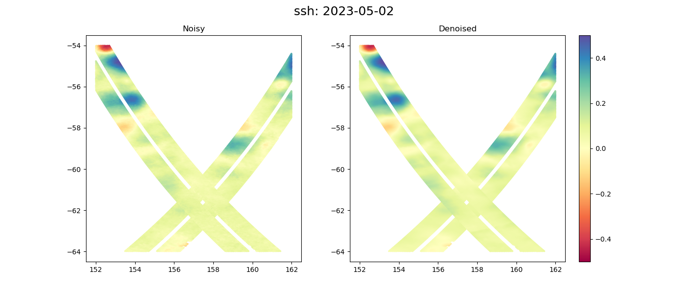
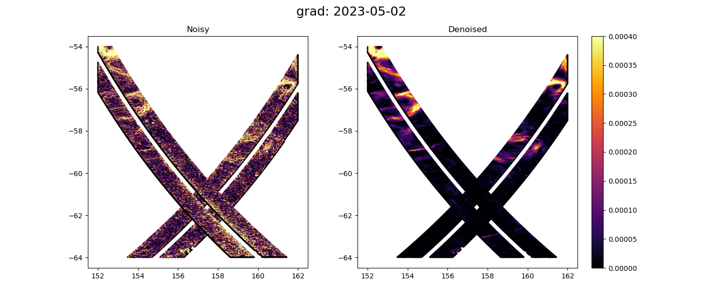
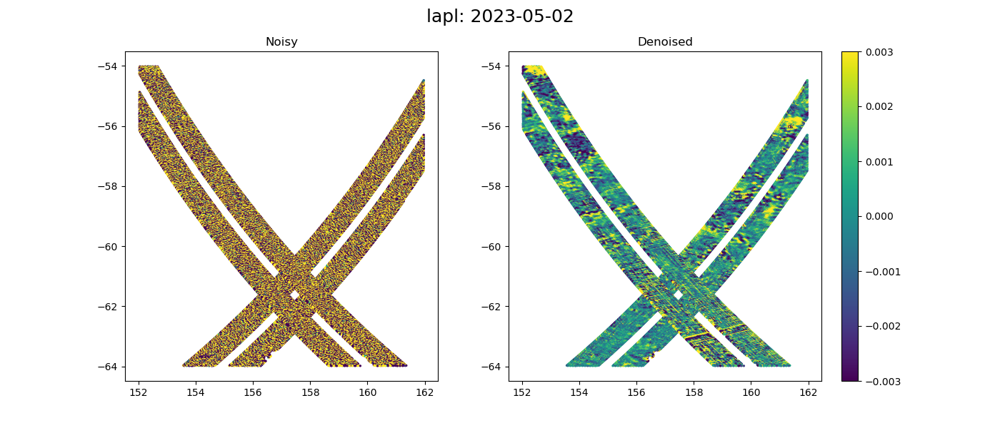
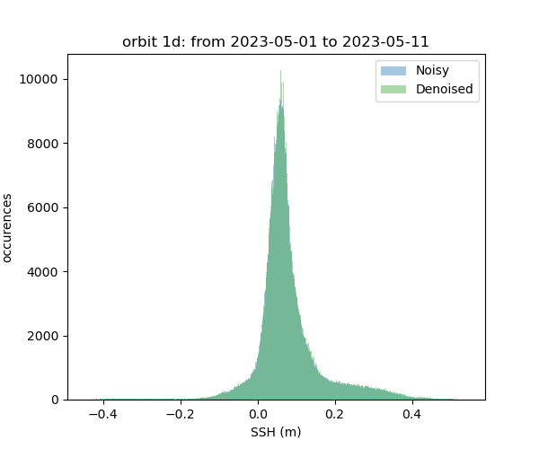
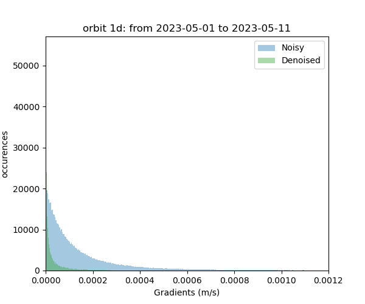
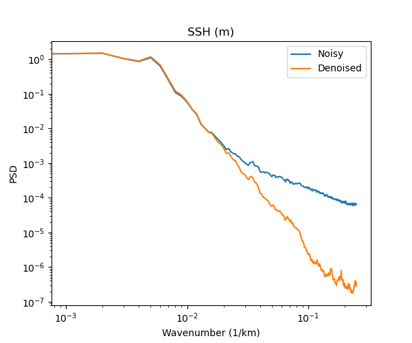
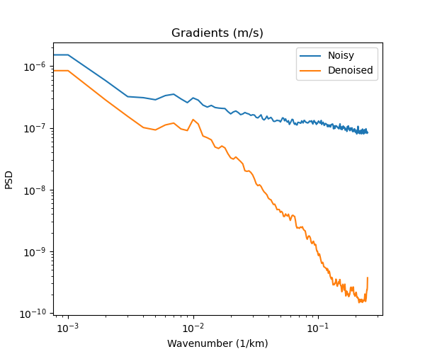
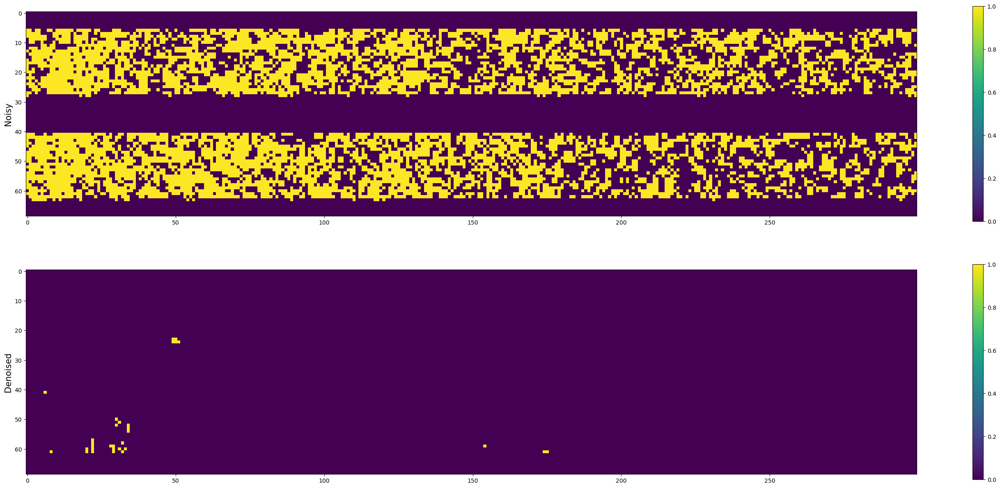
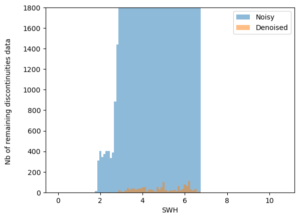
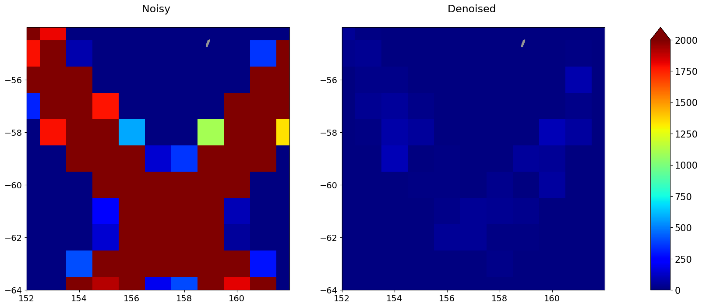

# Antarctic Circumpolar Current region

 

 

<h2>▶️ Snapshots</h2>
 

|**SSH**| 
|------------| 
| |  

|**Gradients of SSH**|
|------------| 
| |  

|**Laplacian of SSH** |
|------------| 
| | 
 

  

<h2>▶️ Movies</h2>
 

 
**SSH**
  
  
<video controls width="800">
  <source src="../_static/v102_ACC/movie_intercomp_v102_ACC_ssh.mp4" type="video/mp4" /> 
  
</video>
 
 
 

**Gradients of SSH** 

<video controls width="800">
  <source src="../_static/v102_ACC/movie_intercomp_v102_ACC_grad.mp4" type="video/mp4" /> 
  
</video>
  

**Laplacian of SSH**  

<video controls width="800">
  <source src="../_static/v102_ACC/movie_intercomp_v102_ACC_lapl.mp4" type="video/mp4" /> 
  
</video>
 

 
  

 

<h2>▶️ Physical pdf</h2>
 
 

| **SSH** | **Gradients of SSH** | **Laplacian of SSH** |
|----|----|----|
|  | |  |

 
 

 

<h2>▶️ Power Spectrum Density</h2>
  

| **SSH** | **Gradients of SSH** | **Laplacian of SSH** |
|----|----|----|
|  | |  |

 

<h2>▶️ Roberts discontinuities</h2>
 
 

| **SSH** | **Gradients of SSH** |  
|----|----| 
|  | | 
| **Roberts discontinuities** | **Masked Roberts discontinuities** |  
|  |  | 

**Total discontinuity percentages**

Discontinuity scores based on the Roberts discontinuities. The scores correspond to the percentage of yellow points with respect to the blue points in the "Masked Roberts discontinuities" Figure above. 

- Noisy SWOT discontinuities: **25.16 %**
- Denoised SWOT discontinuities: **0.12 %** 

| **Discontinuities function of SWH** |   
|----| 
|  |

| **Discontinuities spatial distribution** |  
|----| 
| |
  

 

<h2>▶️ Structural similarities over 1 day repeat</h2>
 
 
<h2>On pass 20</h2>

| **SSHa** |  
|----|
|  |  
| **Velocities** |  
|  |  
| **Relative vorticity** |  
|  | 

 

**Average SSIM on SSHa** 
|    |**SSHa**|**Velocities**|**Relative vorticity**|
|----|----|----|----|
| Noisy SWOT |  **0.950**| **0.289** |**0.153**|
| Denoised SWOT |  **0.953** | **0.828**|**0.444**|
| Residual |  **0.159** |  **0.184** |**0.140**|
 
 
  

 

 

 

 